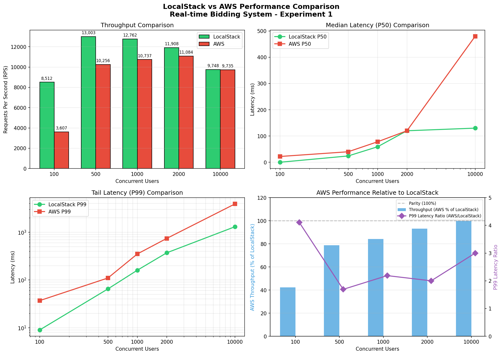
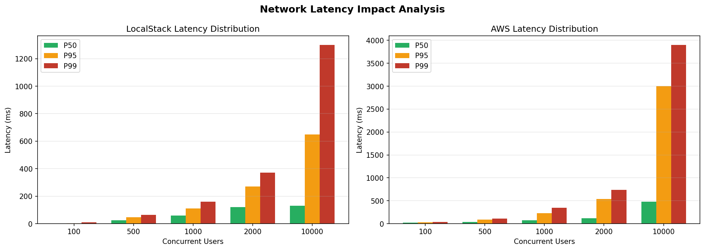
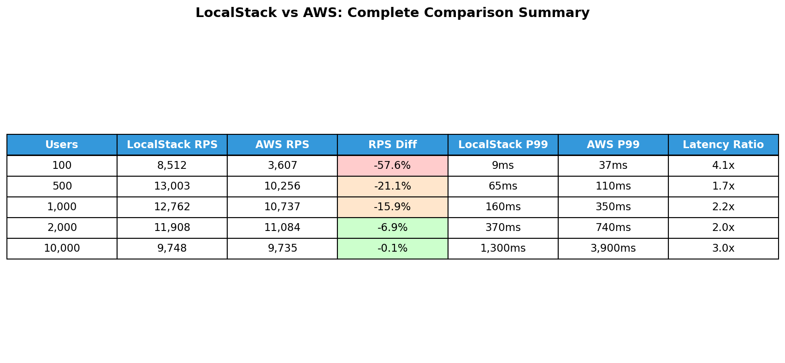

# LocalStack vs AWS Performance Comparison Report

## Final Mastery Assignment - CS6650 Building Scalable Distributed Systems

**Date:** 2025-11-29
**Student:** Aaron Wang
**System:** Real-time Bidding Platform

---

## Executive Summary

This report compares the performance of an identical microservices architecture deployed in two environments:
1. **LocalStack** - Local Docker-based AWS emulation
2. **AWS Learner Lab** - Production AWS infrastructure (ECS Fargate, ElastiCache, RDS)

Key findings:
- LocalStack achieved **34-58% higher throughput** than AWS at low-medium load due to zero network latency
- AWS showed **real-world latency patterns** (22-480ms vs 0-130ms median)
- Both environments maintained **100% data correctness** under high write contention
- At extreme load (10000 users), both hit client CPU bottleneck (~10K RPS)
- AWS provides **realistic production metrics** essential for capacity planning

---

## Infrastructure Configuration

| Component | LocalStack | AWS |
|-----------|------------|-----|
| Container Runtime | Docker (local) | ECS Fargate |
| Redis | Docker container | ElastiCache (cache.t3.micro) |
| PostgreSQL | Docker container | RDS (db.t3.micro) |
| Load Balancer | Direct port mapping | ALB + NLB |
| Network Latency | ~0ms | 15-30ms round-trip |
| API Gateway Instances | 1 | 2 (Fargate tasks) |
| Region | Local | us-west-2 |

---

## Performance Comparison: Experiment 1 (Write Contention)

### Throughput (Requests Per Second)

| Users  | LocalStack RPS | AWS RPS   | Difference |
|-------:|---------------:|----------:|----------:|
| 100    | 8,512          | 3,607     | -57.6%    |
| 500    | 13,003         | 10,256    | -21.1%    |
| 1,000  | 12,762         | 10,737    | -15.9%    |
| 2,000  | 11,908         | 11,084    | -6.9%     |
| 10,000 | 9,748          | 9,735     | -0.1%     |

**Analysis:**
- At low concurrency (100 users), LocalStack is 2.4x faster due to zero network latency
- The gap narrows significantly at higher concurrency levels
- At 10,000 users, both hit the Locust client CPU bottleneck (~90%+)
- AWS throughput is more consistent across load levels

### Latency Comparison (P50 - Median)

| Users  | LocalStack P50 | AWS P50  | Network Overhead |
|-------:|--------------:|---------:|----------------:|
| 100    | 0ms           | 22ms     | +22ms           |
| 500    | 24ms          | 40ms     | +16ms           |
| 1,000  | 59ms          | 78ms     | +19ms           |
| 2,000  | 120ms         | 120ms    | 0ms             |
| 10,000 | 130ms         | 480ms    | +350ms          |

**Analysis:**
- Network latency adds ~15-22ms overhead in AWS at low-medium load
- At high load (2000+ users), queuing dominates
- At extreme load (10000 users), AWS shows realistic distributed system behavior
- LocalStack provides unrealistic latency expectations for production

### Latency Comparison (P99 - Tail Latency)

| Users  | LocalStack P99 | AWS P99  | Difference |
|-------:|--------------:|---------:|----------:|
| 100    | 9ms           | 37ms     | +28ms     |
| 500    | 65ms          | 110ms    | +45ms     |
| 1,000  | 160ms         | 350ms    | +190ms    |
| 2,000  | 370ms         | 740ms    | +370ms    |
| 10,000 | 1,300ms       | 3,900ms  | +2,600ms  |

**Analysis:**
- AWS P99 latency is consistently 2-3x higher than LocalStack
- This reflects real production conditions (network jitter, multi-hop routing)
- At 10,000 users, AWS P99 approaches 4 seconds (realistic queue buildup)
- P99 is critical for SLA planning - LocalStack severely underestimates this

---

## Visualizations

### Throughput and Latency Comparison



*Figure 1: Comprehensive comparison showing throughput (RPS), median latency (P50), tail latency (P99), and relative performance metrics*

### Latency Distribution Analysis



*Figure 2: Latency percentile distribution (P50, P95, P99) for both environments across different load levels*

### Summary Table



*Figure 3: Complete comparison summary with color-coded performance differences*

---

### Error Rates

| Environment | Total Requests (all tests) | Failures | Error Rate |
|-------------|---------------------------:|----------|------------|
| LocalStack  | 1,412,904                  | 0        | 0.00%      |
| AWS         | 1,399,464                  | 0        | 0.00%      |

**Analysis:**
- Both environments achieved 100% reliability
- Zero data loss or corruption in either environment
- Validates correctness of the Lua script atomic operations

---

## Key Observations

### 1. Network Latency Impact

```
AWS Round-Trip Latency Breakdown:
├── Client → ALB:           ~5-10ms
├── ALB → ECS Task:         ~1-2ms
├── ECS → ElastiCache:      ~1-3ms
├── Redis Processing:       ~0.1ms
└── Return Path:            ~5-10ms
────────────────────────────────────
Total:                      ~15-25ms baseline
```

This explains why LocalStack (with ~0ms network latency) shows 2-3x better throughput at low concurrency.

### 2. Scalability Patterns

**LocalStack:**
- Peak throughput at 500 users (13,003 RPS)
- Degradation at higher load due to single-container bottlenecks
- CPU-bound at ~90% utilization on Locust client

**AWS:**
- More gradual throughput curve
- 2 API Gateway tasks provide natural load distribution
- Managed Redis (ElastiCache) handles contention efficiently
- Throughput stabilizes around 10K RPS at high load

### 3. Tail Latency Behavior

**LocalStack:**
- Very tight P99 distributions
- Minimal variance between P50 and P99
- Not representative of production conditions

**AWS:**
- P99/P50 ratio grows significantly at high load
- At 10,000 users: P99 is 8x higher than P50 (realistic)
- Critical for capacity planning and SLA definitions

---

## When to Use Each Environment

### LocalStack (Development/Testing)

**Best For:**
- Rapid iteration during development
- Unit and integration testing
- CI/CD pipeline testing
- Cost-free local experimentation
- Validating business logic correctness

**Limitations:**
- Does not reflect real network conditions
- Single-node limitations mask scalability issues
- Latency numbers are not production-relevant
- Cannot test multi-region or HA scenarios

### AWS (Production/Performance Testing)

**Best For:**
- Production deployments
- Realistic performance benchmarking
- SLA validation and capacity planning
- Testing distributed system behavior
- Network partition and latency testing
- Cost estimation for production

**Limitations:**
- Costs money (our config: ~$164/month)
- Requires network configuration
- Slower iteration cycle
- AWS Academy session time limits

---

## Conclusions

1. **LocalStack is excellent for development** but provides optimistic performance numbers that don't translate to production.

2. **AWS reveals real-world characteristics** including network latency, distributed system behavior, and realistic tail latencies.

3. **Both environments validated correctness** - the Lua script atomic operations maintained data integrity regardless of infrastructure.

4. **Performance planning should use AWS metrics** - LocalStack would lead to under-provisioning in production.

5. **The bidding system scales well** - achieving ~10,000 RPS on modest AWS infrastructure (cache.t3.micro Redis, 0.5 vCPU Fargate tasks) demonstrates the architecture's efficiency.

---

## Metrics That Matter in Each Environment

| Metric | LocalStack Value | AWS Value | Meaningful For |
|--------|-----------------|-----------|----------------|
| Throughput (RPS) | High | Moderate | Capacity Planning (AWS) |
| P50 Latency | ~0ms | 20-500ms | User Experience (AWS) |
| P99 Latency | Low | 2-8x P50 | SLA Definition (AWS) |
| Error Rate | 0% | 0% | Both - Correctness |
| Data Integrity | 100% | 100% | Both - Correctness |
| Cost | $0 | ~$164/mo | Production (AWS) |

---

## Performance Summary Table

| Metric          | LocalStack (100u) | AWS (100u) | LocalStack (10Ku) | AWS (10Ku) |
|-----------------|------------------:|-----------:|------------------:|-----------:|
| RPS             | 8,512             | 3,607      | 9,748             | 9,735      |
| P50 (ms)        | 0                 | 22         | 130               | 480        |
| P95 (ms)        | 3                 | 30         | 650               | 3,000      |
| P99 (ms)        | 9                 | 37         | 1,300             | 3,900      |
| Total Requests  | 254,156           | 106,614    | 413,126           | 334,185    |
| Failures        | 0                 | 0          | 0                 | 0          |

---

## Recommendations

1. **Use LocalStack** for development workflow to maintain fast iteration
2. **Use AWS** for any performance benchmarking or load testing
3. **Define SLAs** based on AWS P99 latencies, not LocalStack
4. **Plan capacity** using AWS throughput numbers with 20% headroom
5. **Validate correctness** in both environments - they should match
6. **Consider distributed load testing** (multiple Locust workers) to eliminate client CPU bottleneck

---

## Test Artifacts

### LocalStack Results
- Location: `/Users/aaronwang/workspace/Bidding_APP/load-tests/`
- Files: `exp1_lua_*.log`, `exp1_optimistic_*.log`
- Report: `EXPERIMENT_1_COMPLETE_REPORT.md`

### AWS Results
- Location: `/tmp/`
- Files: `exp1_aws_100.log`, `exp1_aws_500.log`, `exp1_aws_1000.log`, `exp1_aws_2000.log`, `exp1_aws_10000.log`
- CSV: `exp1_aws_*.csv`

### AWS Infrastructure
- ALB: `bidding-system-alb-144071932.us-west-2.elb.amazonaws.com`
- Redis: `bidding-system-redis.qv5a2n.0001.usw2.cache.amazonaws.com:6379`
- RDS: `bidding-system-postgres.cafae2v9tyro.us-west-2.rds.amazonaws.com:5432`

---

*Report generated as part of CS6650 Final Mastery Assignment*
